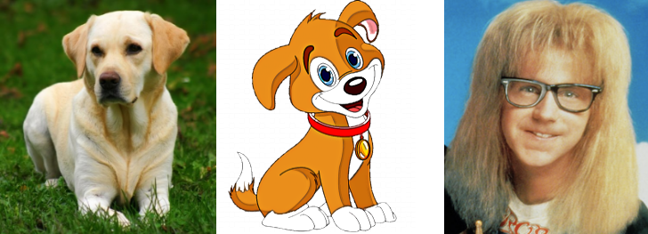
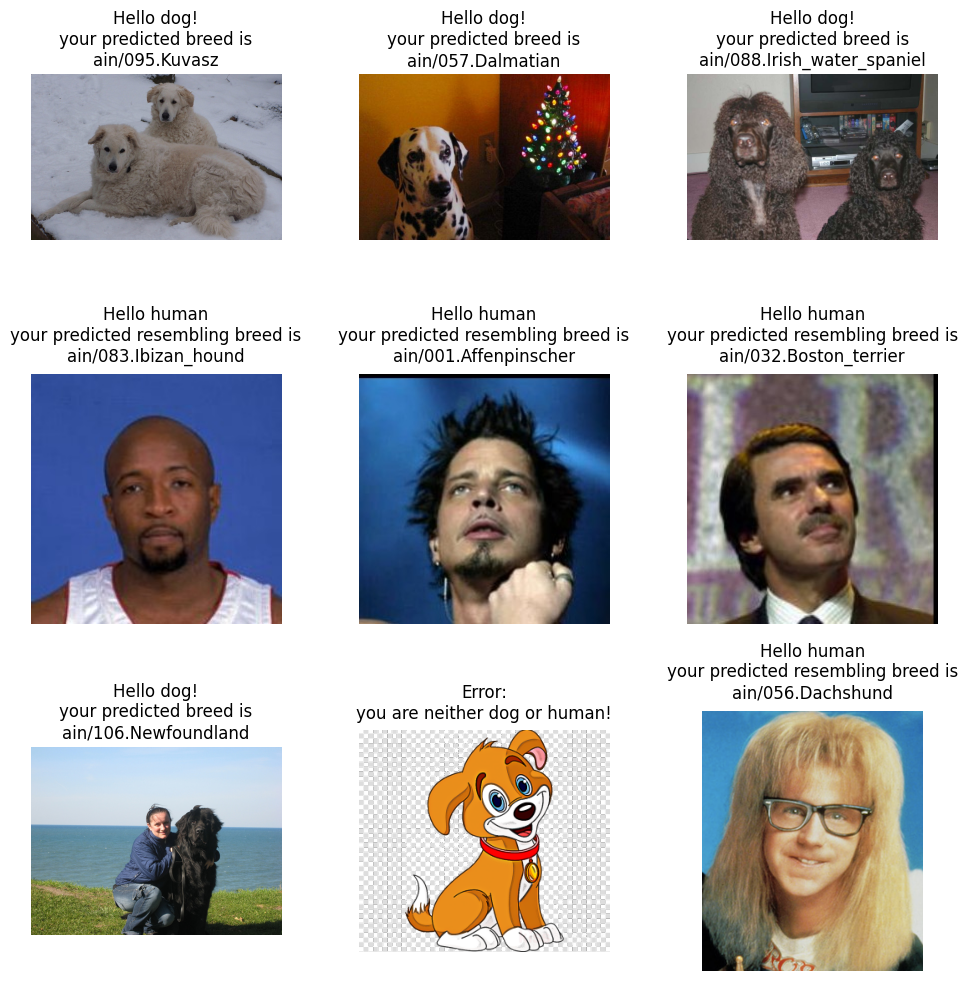

<p align="center">
  <a href="">
    
  </a>
</p>

## Dog Breed Project
This repo contains the implementations of the Dog Breed Project, which is the capstone project of the Udacity Data Scientist Program.

## Table of contents

- [Overview](#overview)
- [Approach](#approach)
- [Installation](#installation)
- [Structure](#structure)
- [Usage](#usage)
- [Limitations](#limitations)

## Overview
This is the implementation of the final project of the Udacity Data Scientist Program. 
This project uses Convolutional Neural Networks (CNNs) to build pipelines to process images. Given an image of a dog, the designed algorithm should identify an estimate of the canine’s breed. If supplied an image of a human, the code will identify the resembling dog breed.
The datasets and pre-generated image features through the CNNs are provided by Udacity. In order to complete the project, I used some other Models and 3rd party libraries.
I followed the sample jupyter notebook provided by Udacity to complete this project.

Here is a sample output as the final result:

<p align="center">
  <a href="">
    
  </a>
</p>

## Approach
The goal of the project is to build a pipeline that includes necessary steps to identify an Image:
- If the image is a dog, output the dog breed.
- If the image is a human, output the resembling dog breed.
- If the image is neither of the above, output an error message.

My general solution to the problem can be summarized using the following algorithm:
```
if (dog_detector(image) != dog):
    if (face_detector(image) != human):
        output error
    else:
        classify_dog(image)
else:
    classify_dog(image)
```

## Installation
The core library versions provided by Udacity, like Tensorflow or Keras is quite old. In order to use some 3rd party modules and libraries, I decided to use an up-to-date version of these core libraries.
In order reproduce the results, you need to install the exact versions of the libraries using the pip:
```
pip install -r requirements.txt
```
I recommend to install into a virtual environment like Anaconda.

## Structure
The folder structure of this repo is as follows:
```
|-bottleneck_features       
  |-                        # the bottleneck features generated by CNNs
|-data                      
  |-                        # the datasets provided by Udacity
|-haarcascades              
  |-                        # the haar cascade detector config xml used by OpenCV
|-images                    
  |-                        # sample images
|-models                    
  |-                        # 3rd party models used in the project
|-saved_models              
  |-                        # keras models saved as h5 file during the course of project
|-dog_app.ipynb             # the main jupyter notebook for the project
|-extract_bottleneck_features.py    # the helper module used by the notebook, provided by Udacity
|-workspace_utils.py        # the utilities regarding the notebook running, provided by Udacity
```
When you clone the repo, not all the folders are there. Don't worry. Just follow the dog_app.ipynb.

## Usage
Just follow the dog_app.ipynb

## Limitations
There are several limitations and points worth improvements after I completed this project.
Please refer to the Medium blog post.